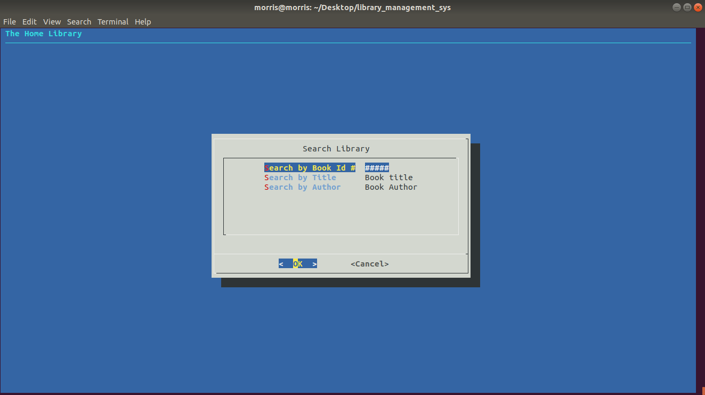
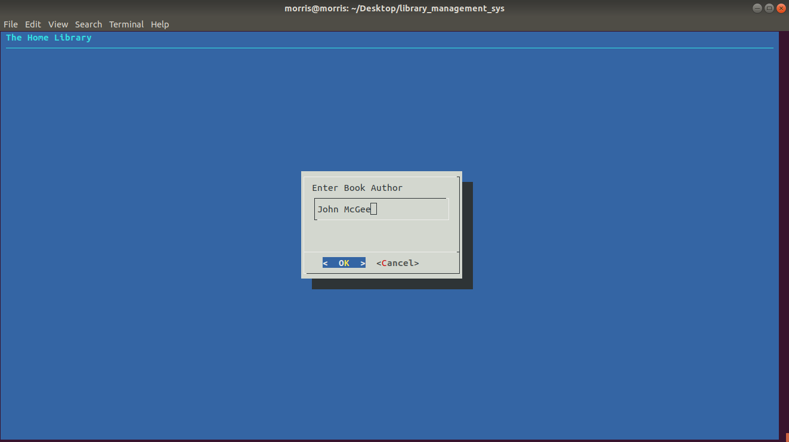
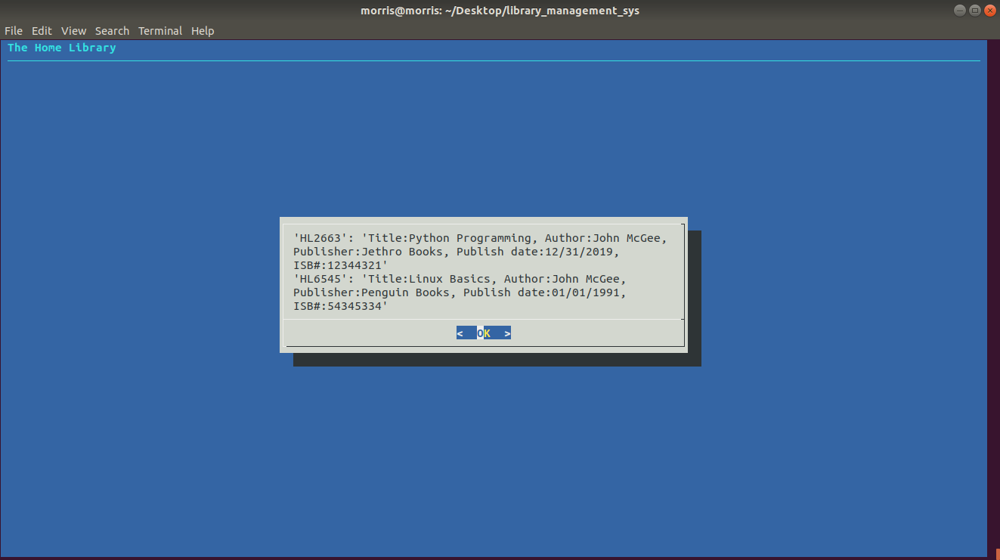
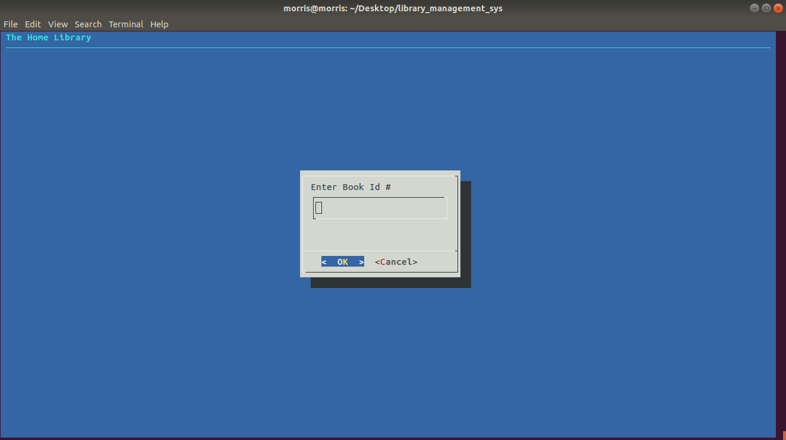
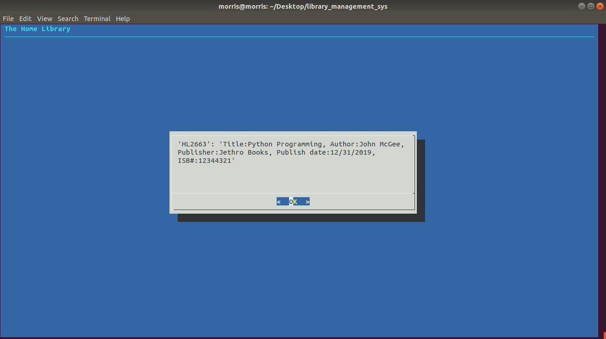

# Personal-Library-System-
A Library Management System for your Personal Collection 

By: Wali Morris 

The Personal, or Home Library System, is a command line based tool to keep track of all your book 
collection needs. This program relies on pythondialog, a Python wrapper for the dialog utility 
initially written by @Savio Lam and later rewritten by @Thomas E. Dickey. The purpose is to provide 
an easy to use pythonic and comprehensive Python interface to dialog. This allows one to make simple 
text-mode user interfaces on Unix like systems(including Linux). 

Home libraries come in many sizes, but if you fancy reading and keeping track of the novels you have, 
then this personal library management system is right for you. Each book is given its own personal 
identification number so you can label, search and keep track of books by means other than it's title, 
author or publisher. Currently, this system can store a collection of 10,000 books! The Library management 
system is an ongoing project as new features are added; features like checking books out if a friend or 
family member wants to borrow one of your favorites or, if you're a real book enthusiast, upgrading to hold 
an even larger collection. Rest assured, this personal management system is quite easy to use. Currently,
there are four different home menu options to choose from: adding a new book to the collection, searching 
your collection of books by its identification number, title or author, deleting a book out right and viewing
all the books in your personal collection.

Searching is made easy. For instance, if someone were to select the search option, there are multiple ways 
to look up a book. You can search by identification number, which is the preferred method and will respond 
with an individual book, if it exists in the library. Here's an example: 

Searching by author is great when you need to know all books by a specific author, if you don't quite remember
the book title or identification number, that's okay. Searching by author will return all books by that author 
and you can go from there. 

Here John McGee was searched, which is still somewhat exact, and all books in the Library by Mr. McGee were
returned. Be careful, searching for only "John", if you can't really remember the author's full name, will 
return all books by John. Whoever John may be. John McGee, John Doyle, John Smith. Though, this can result 
in a long list of books by John, its also great when you can't remember the author but you have a small piece 
of information to search for. So, this can also be a good thing. Here's what the search for our made up author
John McGee resulted in: 

Searching by Id is the most proficient. Here's an example: 

Searching by a books' personal identification number will return one book, the book that's linked to that specific 
number that's generated when the book is created by whomever has access to the library management system. This 
should be the most proficient way to search for a book and will most likely give the exact results you want. 

This is as far as we'll go with examples. There are more features to explore, and ofcourse more features that'll be 
added as this project grows. For now, you're equipped to navigate this your personal library management system and 
grow your book collection!

**HOW To Run:** 

The Home Library System is a one time setup. After the first initial install, dialog is installed and a symbolic 
link is created within the directory that your Home Library lives. Anytime after the initial setup you should just run 
'python3 library' from this directory to start up The Home Library program. It's recommended that The Home Library lives within the home directory and your system is updated often. Here's what you should do from your home directory: 

***First: clone this repo(it's recommended to do this from the home directory, if not you'll need to manually set-up)***

`git clone https://github.com/walimorris/Personal-Library-System-.git`

***Secondly: change into the directory holding The Library System program***

`cd Personal-Library-System-/`

***Next: Now, we need to make the startup script executable and run it*** 

`chmod +x startup.sh && ./startup.sh`

***Lastly: Everything is setup, now just run the command below anytime you want to use The Home Library***
***Note: The script makes it possible to run this directly from the home directory***

`python3 library`

